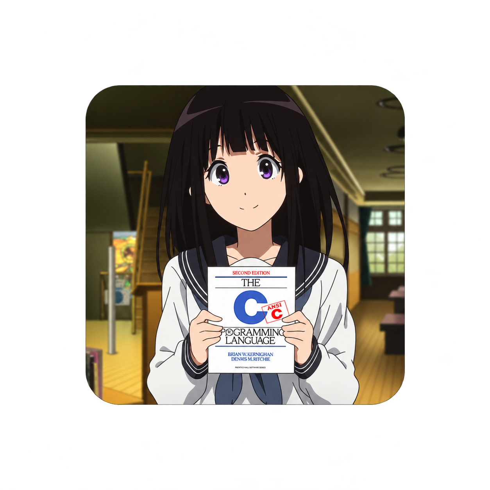
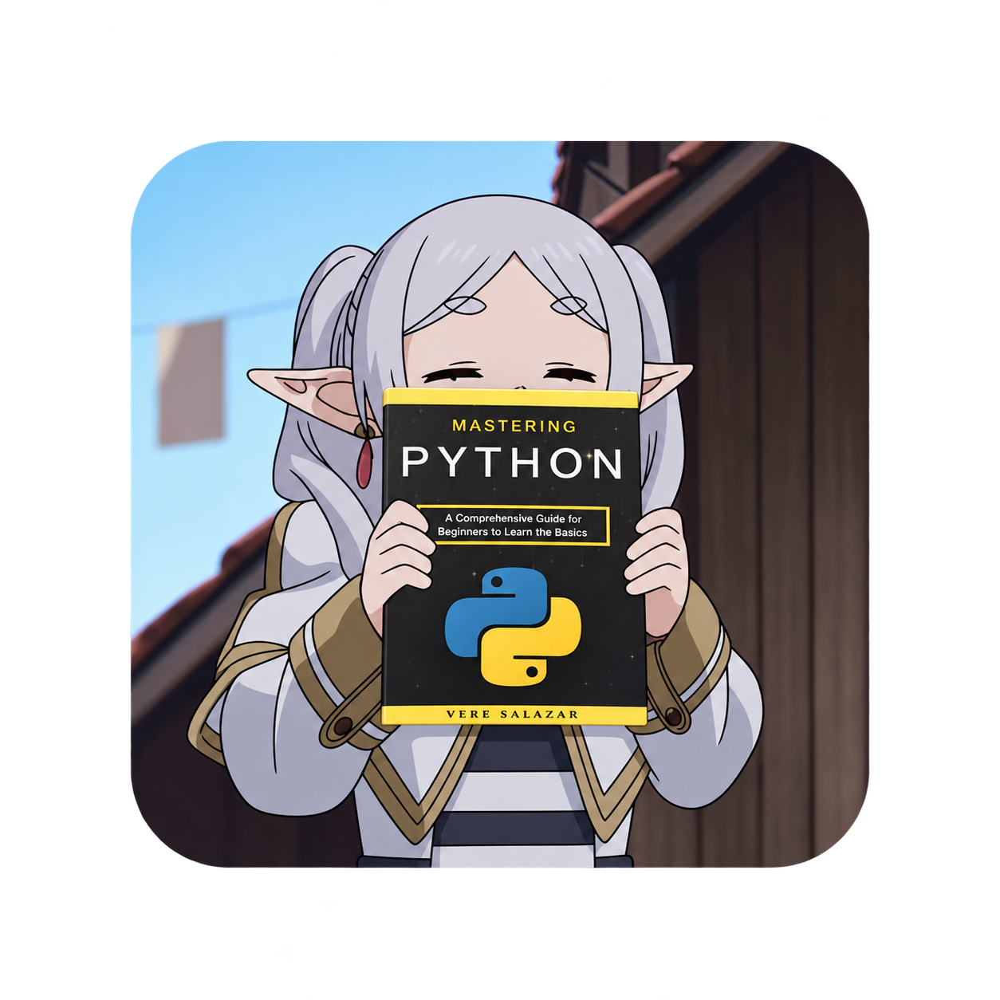
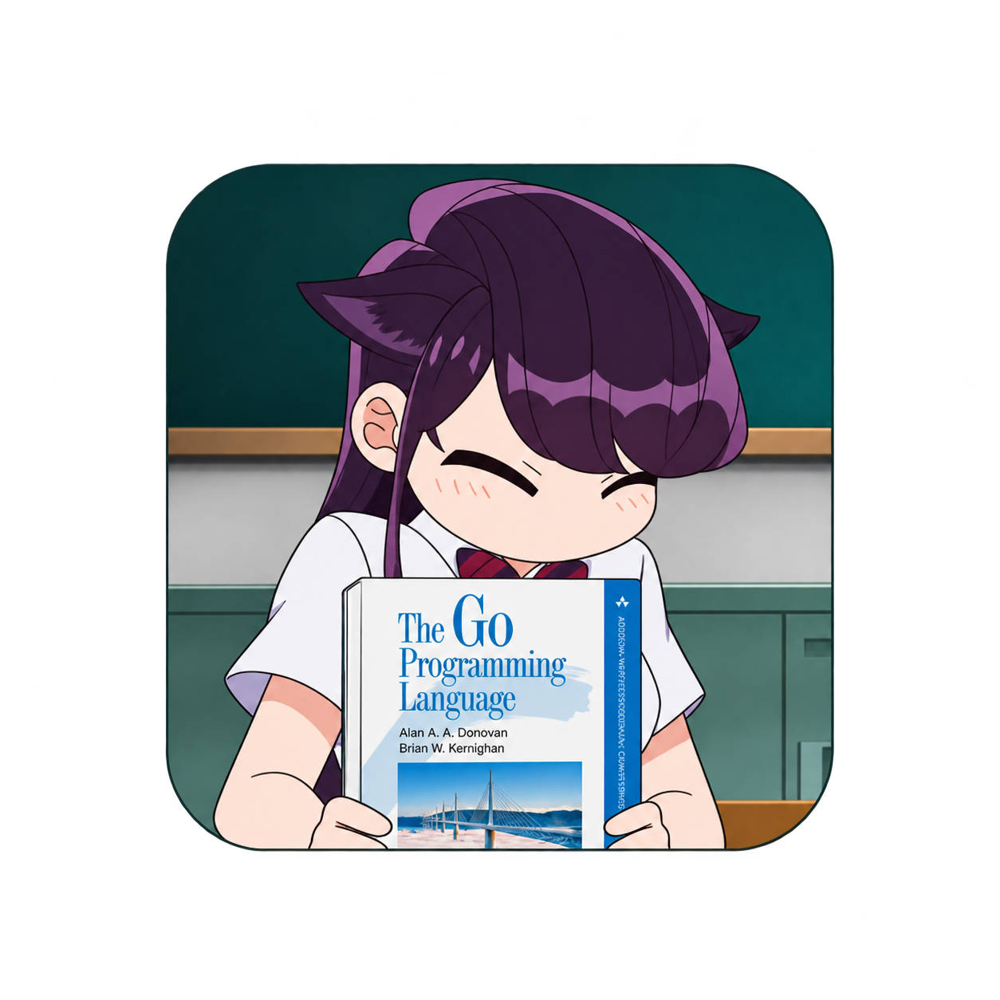
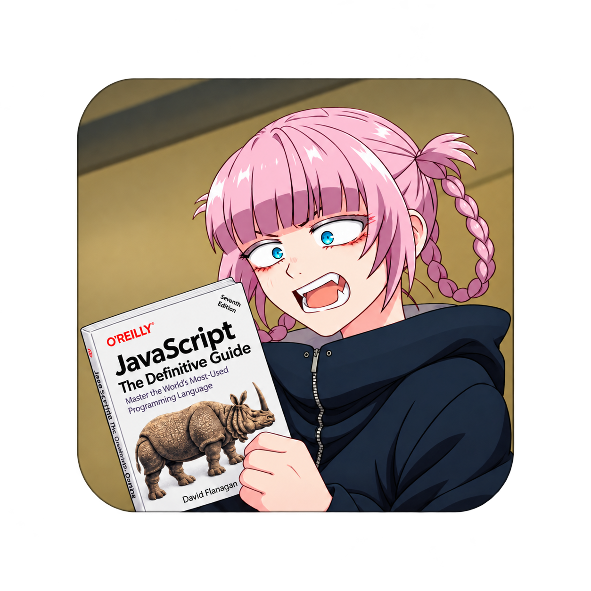
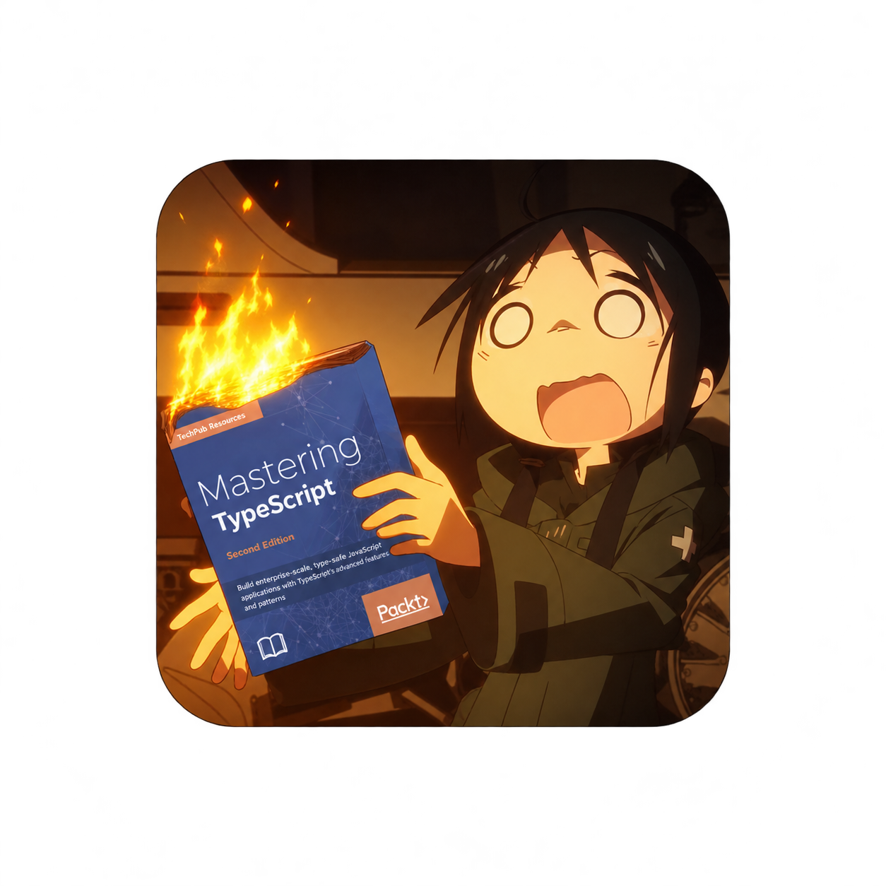
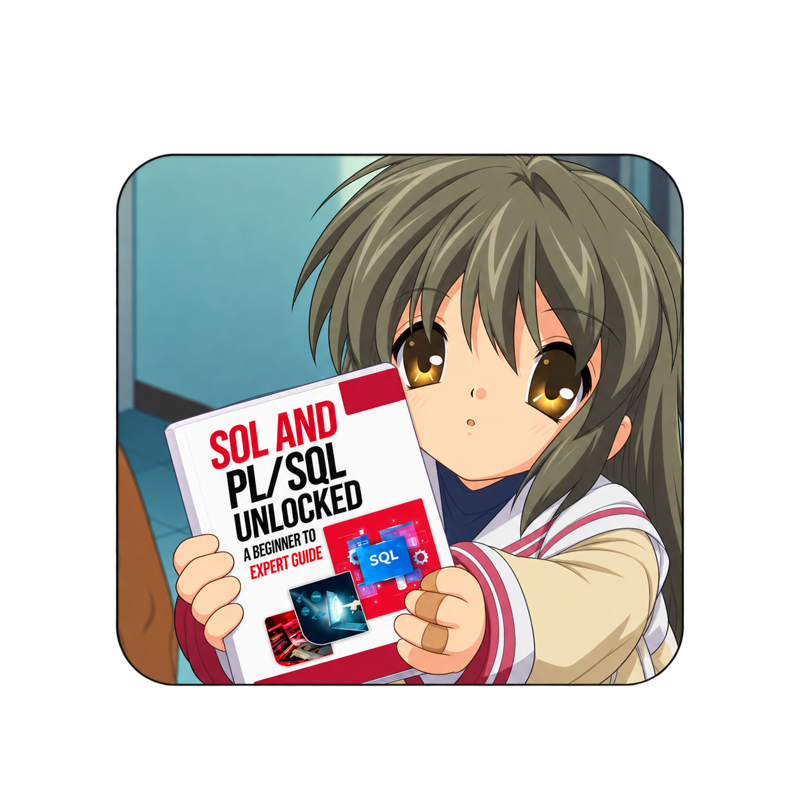
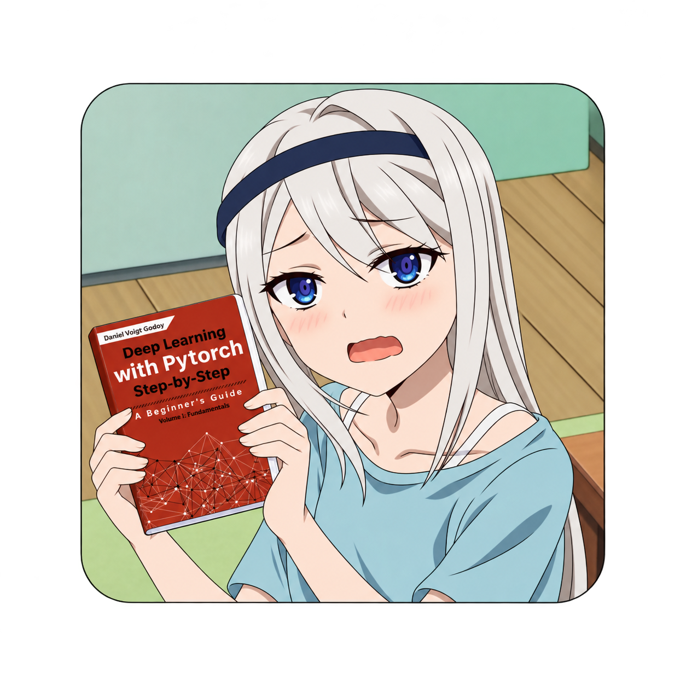
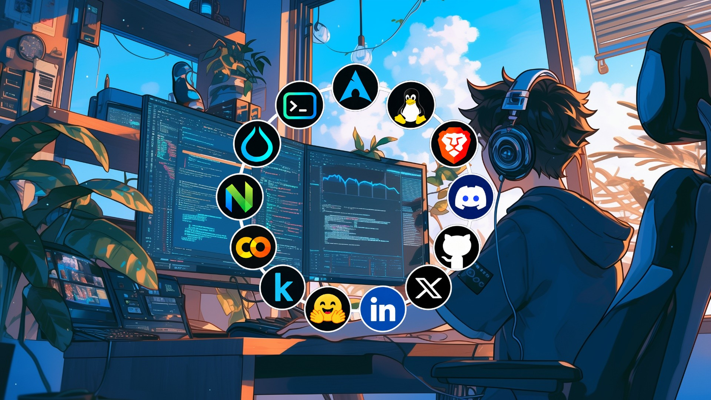
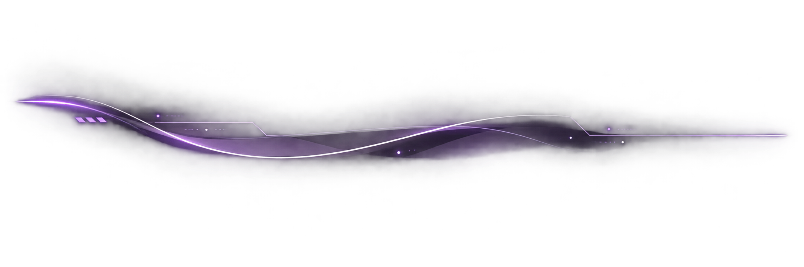

<div align="center">


<br>

# ✦ I am Jasmin

<br>

<table>
  <tr>
    <td align="center" valign="middle">
      
    </td>
    <td valign="middle">
<pre>
 _   _ _____ _     _       ___    __        __  ___  ____  _     ____  
| | | | ____| |   | |     / _ \   \ \      / / / _ \|  _ \| |   |  _ \ 
| |_| |  _| | |   | |    | | | |   \ \ /\ / / | | | | |_) | |   | | | |
|  _  | |___| |___| |___ | |_| |    \ V  V /  | |_| |  _ &lt; | |___| |_| |
|_| |_|_____|_____|_____| \___/      \_/\_/    \___/|_| \_\_____|____/ 
</pre>
    </td>
  </tr>
</table>

<br>

<h3 align="center">✦ Intro</h3>

<table>
  <tr>
    <td>
<pre>
<b>jasmin@arch</b> ~ $ whoami
────────────────────────────────────────────────────

 <b>Name</b>       ›  Jasmin
 <b>Age</b>        ›  19
 <b>Roots</b>      ›  Gujarat, India
 <b>Education</b>  ›  Diploma in Computer Engineering
 <b>Mindset</b>    ›  Intellectual Omnivore
 <b>OS</b>         ›  Arch Linux (Hyprland / Caelestia)
 <b>Mission</b>    ›  PTE Academic &amp; Global Degree Journey

────────────────────────────────────────────────────
 <i>"Fall, learn, build, rise — and never stop exploring."</i>
</pre>
    </td>
  </tr>
</table>

<br>

<h3 align="center">✦ Languages</h3>

<br>

<table>
  <tr>
    <td align="center">
      <br>
      <b>C++</b>
    </td>
    <td align="center">
      <br>
      <b>C</b>
    </td>
    <td align="center">
      <br>
      <b>Python</b>
    </td>
  </tr>
  <tr>
    <td align="center">
      <br>
      <b>Go</b>
    </td>
    <td align="center">
      <br>
      <b>JavaScript</b>
    </td>
    <td align="center">
      <br>
      <b>TypeScript</b>
    </td>
  </tr>
  <tr>
    <td align="center">
      <br>
      <b>HTML &amp; CSS</b>
    </td>
    <td align="center">
      <br>
      <b>SQL</b>
    </td>
    <td align="center">
      <br>
      <b>PyTorch</b>
    </td>
  </tr>
</table>

<br>

<h3 align="center">✦ Workspace</h3>

<br>



<br>
<br>



</div>

<!--
<div align="center">

  

  <a href="https://git.io/typing-svg">
    
  </a>

  <p align="center">
    <a href="https://github.com"></a>
    <a href="https://archlinux.org"></a>
    <a href="#"></a>
  </p>

  <p align="center">
    <a href="https://github.com/jasmin1727"></a>
    <a href="https://linkedin.com/in/jasmin-thakor-834083400"></a>
    <a href="https://x.com/JThakor40699"></a>
  </p>

  <p align="center">
    
  </p>

</div>

---

### ⚡ About Me

```yaml
Name: Jasmin
Age: 19
Roots: Gujarat, India
Education: Diploma in Computer Engineering
Philosophy: "Fall, learn, build, rise — and never stop exploring."
Mindset: Intellectual Omnivore
Daily Driver: Arch Linux (Hyprland / Caelestia)
Current Mission: PTE Academic & Global Degree Journey
```

* 🚀 **Who I Am:** A 19-year-old self-driven developer from Gujarat, India who fell in love with code, systems, and deep-dive learning.
* 🐧 **System Geek:** Running **Arch Linux** with custom **Hyprland** dotfiles and rices. I love understanding how operating systems, kernels, and memory work under the hood.
* 🌐 **Full-Stack Journey:** Built projects across the stack — from raw HTML/CSS/JS experiments and anime streaming sites to React, Next.js, TypeScript, Python, and Go terminal tools.
* 📖 **The Learning Ethos:** Everything I know is self-taught through curiosity, endless documentation, and raw persistence.

---

<div align="center">

### 🛠️ Languages & Technologies

<a href="https://skillicons.dev">
  
  <br/>
  
</a>

<br/><br/>

### 💻 Workspace & Tools

<p align="center">
  
  
  
  
  
</p>

</div>

---

<div align="center">

### 📊 GitHub Activity & Metrics

<br/>


<br/>


<br/><br/>


<br/><br/>


<br/><br/>


</div>

---

<div align="center">
  <sub>Designed with ❤️ by Jasmin • Powered by Curiosity & Arch Linux</sub>
</div>


The Long Way Here

Chapter 1: The Day I Was Humiliated

My journey did not begin with a triumph. It began with embarrassment. When my friends and I walked back into the lab, the students and teachers looked at us as if we were strangers. We told the ma'am that we were students of her class, and she asked where we had been all this time. The humiliation of that day is hard to describe. I did not have much respect there to begin with, but that moment stripped away what little was left.

Still, I cleared my fourth semester on the first attempt, with no backlogs. Quietly, I also decided to start learning HTML, CSS and JavaScript at a coding class. I attended for only about two months. The batch timings clashed with my diploma, and nothing settled. I never even went back to collect the certificate. But those two months taught me something that no certificate could. I discovered what coding actually is, and that there are many kinds of languages, each with its own purpose.

Chapter 2: The Golden Six Months

After the fourth semester came the fifth and sixth, and for most of that stretch I spent about 80% of my time at home. Around then, my father bought me a new laptop. It was a simple machine worth about ₹35,000. He judged it by its RAM and storage, because he did not know how to read processors and graphics cards. It did not matter. Those six months became the golden period of my life.

For the first month and a half, I wrote nothing but HTML, CSS and JavaScript. As I learned, my interest kept growing. I built a calculator, tic-tac-toe, and many small things. I spent twenty days on an anime streaming website, filling it with posters and listings. When I tried to deploy it, I realized that websites do not simply "run." A complete system stands behind them, and that system is what people call full-stack. I learned that databases exist, what a frontend is, what a backend is, and that until then I had only been building the client side.

From there I tried everything. I learned React and Next.js, not completely, but enough to understand them. AI agents were already good at building polished websites, and I used them to build many SaaS products. I never deployed even one, because I had no money for it. But I could say one thing honestly. I had learned how to fall, how to learn, and how to gain experience.

My curiosity grew. I wanted to know everything. I explored GitHub, studied how professional developers work and how one becomes one, and created my own GitHub, LinkedIn and X accounts. I wanted to understand how jobs and real work function. It was going well. I started learning Python as well. Everything I know, I learned from YouTube: HTML, CSS, JavaScript, Node.js, React, TypeScript and Next.js.

Chapter 3: The Collapse

Then my exams arrived, at the same time as Python. I had barely paid attention to that semester, and I got a backlog in one subject. Around the same time, my laptop, which had been struggling for a while, developed an SSD problem and died completely.

After that, everything stopped. I went back to games and back to my old life. I do not even want to explain that period in detail, because I was broken. I spent far too much time gaming. During those months, my sweet grandmother passed away. I felt I had lost everything, and my father was lost in his grief as well. For the first time, I understood what it truly means to lose something, and what it means to live.

Chapter 4: Learning Without Resources

For a while, I blamed my lack of resources. I told myself I had no laptop, so I could not learn. But the truth was that I also lacked the habit of learning with what I had. So I changed that. I installed coding apps, a terminal and books on my phone. I watched videos, wrote code on mobile, and ran heavy workloads on a server. By the end of my fifth semester, I had completed my Python journey.

Chapter 5: The Machine That Was Not Mine

At the beginning of my sixth semester, my father arranged a Mac mini for me through a friend of his. It was a tiny box, not a grand machine, and it came with a monitor and the rest of the setup for ₹15,000. It was more of a rental than a purchase. I paid to use it, but it was never truly mine, and the owner could take it back whenever he wished. Still, I was excited. It was an Apple computer, and I finally had a machine to work on again.

When it arrived, the specifications were modest. It had an Intel Core i5-4260U with 2 cores and 4 threads, a base clock of 1.40 GHz and a turbo boost of 2.70 GHz, drawing only 15 watts. The graphics were an integrated Intel HD Graphics 5000, with no dedicated card, so the video memory was shared dynamically from the system RAM. It had just 4 GB of RAM and 120 GB of storage.

What surprised me most was that it was not running macOS at all. It ran Windows, and for a moment I doubted whether it was a Mac at all. Windows alone consumed half of the RAM, and that pushed me to look deeper into operating systems.

Chapter 6: The Linux Journey

I began to study operating systems seriously. I installed Arch, Ubuntu, Mint and Kali, and I had used many other systems before. In the end, Arch was where I settled. I discovered "rices," which are customized desktop setups built on window managers like Hyprland and bspwm, and some of them look stunning. I tried many of them. One rice, Caelestia, was the reason I moved from Ubuntu to Arch. I then started browsing Reddit, installing every beautiful setup I found.

If I explained the whole Linux journey, it would become longer than everything above. I remember setting up Arch and installing dotfiles, and sometimes the network would not even connect. I spent two full days fixing a single problem. After that, I realized I had again gained a great deal of knowledge about the internet, coding, AI agents and LLMs.

Toward the end of my sixth semester, I also began learning C and C++. I did not finish them, but I understand them to a fair degree. Around the same time, I was drawn into LLMs. I built two of my own. One uses the transformer architecture of DeepSeek 4.1 as its base, and the other I designed from my own architecture. Both are tiny. I have only fine-tuned them lightly, and neither has been properly trained yet. They exist, but they are unfinished.

Alongside that, I explored cyber security and watched many lectures on it. I know a little about it, and a little about reverse engineering as well, though nothing deep.

Chapter 7: Trying Everything, Earning Nothing

I also explored ways to earn: YouTube, Instagram content creation, Facebook, freelancing and dropshipping. I tried them all, and I cannot cover everything in one telling. To be honest, I am still at zero. I have not earned anything. But I am not crying about it. I gained knowledge. I gained experience. And I am still standing here.

Chapter 8: What Changed Inside Me

There was one more thing that I slowly began to understand. I had changed. I started staying away from people, living only in my room, and eventually even from the people at home. I could not talk properly with anyone. I could not even laugh at someone's joke.

I never held onto one single thing. I tried everything and gained a lot of knowledge, but nothing became mine alone. Sometimes I would go very deep into even a small thing. In a way, I had become an intellectual omnivore, and I was also the loneliest I had ever been. I even wandered into things that made little logical sense.

I never wanted to master one thing. I wanted to take knowledge from every place. I simply began to love learning, and staying there and mastering it was never my hobby. Then it all started to make sense. There is joy in it, and perhaps that is why people say knowledge is a curse. But it is a curse I have learned to carry, because every bit of it brought me here.

Chapter 9: Where I Stand Today

This story is not finished, and I am not writing it from the end. I am writing it from the middle.

Right now, I am preparing for the PTE Academic exam. It is my bridge to something bigger. Alongside it, I have secured admission to a college as a backup, so that my education never stops, whatever happens. The plan is simple, and it is honest.

If I clear the PTE, I will apply to universities abroad and pursue my degree there. If I cannot crack it, I will complete my degree here and keep building from where I stand.

What I want next is depth. I want to go deeper into building and training LLMs, and to finally complete the two I started. I also want to build real sources of income, so that all my learning can stand on its own feet.

I have done so much, but I wish I had stuck with even one thing properly. Then my life would already be built today.

Either way, the direction does not change. I have learned that I can fall, learn and rise again, and I have learned it with almost nothing in my hands. Whatever path opens next, I will walk it with everything these years have taught me.

So I will end this chapter of my journey the same way I began to understand it: not with a victory, but with a promise.

I do not know yet what the next chapter holds. But I know I will keep learning, keep building, and keep going. When the next updates come, I will write them here.

Until then, my future self, see you later.
-->
